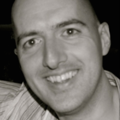

    

    

    
    <h3>Anthony Austin</h3>
    Anthony Austin started as a DPhil student at Oxford in 2012. When not
    doing research related to contour integrals, large-scale linear algebra,
    and rational approximation, he is our code guru, keeping us honest with
    object-oriented programming and Git. After Nick Hale, he is the team
    member responsible for the most lines of Chebfun v5.
    

    

    

    

    
    <h3>Zachary Battles</h3>
    Zachary Battles was a Rhodes Scholar and DPhil student from 2002 to 2005,
    and he wrote Chebfun version 1.  It has hard to believe it was just a few
    hundred lines of code!  Zachary introduced the recursive rootfinding
    algorithm in ROOTS as well as commands such as QR, SVD, \, RANK and COND
    for quasimatrices.
    

    

    

    

    
    <h3>&#193;sgeir Birkisson</h3>
    Asgeir Birkisson was an MSc and then DPhil student at Oxford from 2008 to
    2014.  With Toby Driscoll he introduced automatic differentiation into
    Chebfun and thus enabled us to solve nonlinear differential equations.  He
    also wrote CHEBGUI.
    

    

    

    

    
    <h3>Toby Driscoll</h3>
    Toby Driscoll, a professor at the University of Delaware, created the ODE
    and integral equations side of Chebfun starting in 2008 and has been one
    of the leaders of the Chebfun project since then. Among other codes he is
    responsible for SOLVEBVP, EIGS, EXPM, VOLT, and FRED.  He has also led
    Chebfun's movement to more advanced linear and nonlinear block structures.
    

    

    

    

    
    <h3>Pedro Gonnet</h3>
    Pedro Gonnet, a quadrature expert, was a postdoc at Oxford from 2009 to
    2012 and introduced a number of speedups to Chebfun. He was a key
    contributor to the robust rational approximation algorithms of RATINTERP
    and PADEAPPROX.
    

    

    

    

    
    <h3>Stefan G&#252;ttel</h3>
    Stefan Guettel was a postdoc at Oxford during 2011 and 2012. Besides
    contributions to Chebfun's rational functions capabilities, Stefan
    introduced CHEBSNAKE.
    

    

    

    

    
    <h3>Nick Hale</h3>
    Nick Hale was a DPhil student at Oxford from 2006 to 2009 and then a
    postdoc until 2014.  He has written more Chebfun code than anyone else as
    well as developing many algorithms related to solution of ODEs and PDEs
    (with Driscoll and Birkisson, including PDE15S) and fast quadrature and
    orthogonal expansions (with Townsend, including SUM, LEGPTS, CHEB2LEG, and
    CONV).  He was director of the Chebfun project from 2010 to 2014 and
    managed the creation of Chebfun version 5.
    

    

    

    

    
    <h3>Hrothgar</h3>
    Hrothgar, a DPhil student at Oxford from 2013, created and manages the
    Chebfun web site introduced in 2014.  He is working on algorithms related
    to block operators, adjoints, and optimization.
    

    

    

    

    
    <h3>Mohsin Javed</h3>
    Mohsin Javed, an MSc and DPhil student at Oxford from 2011, is Chebfun's
    expert on delta functions and associated algorithms and mathematics,
    including DIRAC.
    

    

    

    

    
    <h3>Georges Klein</h3>
    Georges Klein, an expert on barycentric and Floater-Hormann interpolation,
    was a postdoc at Oxford during 2012 and 2013. He introduced the "EQUI"
    operation in the Chebfun constructor.
    

    

    

    

    
    <h3>Hadrien Montanelli</h3>
    Hadrien Montanelli started as a DPhil student at Oxford in 2013. He is
    interested in fundamental algorithms and theorems related to numerical
    computation with functions.
    

    

    

    

    
    <h3>Ricardo Pach&#243;n</h3>
    Ricardo Pach&#243;n was Chebfun team member #3, arriving at Oxford as a
    DPhil student in 2006.  With Rodrigo Platte, he advanced Chebfun from
    global polynomials to piecewise polynomials, and became an expert in
    approximation algorithms, including REMEZ, CHEBPADE, and LEBESGUE.
    

    

    

    

    
    <h3>Rodrigo Platte</h3>
    Rodrigo Platte, Chebfun team member #4, was a postdoc at Oxford from 2007
    to 2009 and worked with Ricardo Pachon to produce Chebfun version 2.
    Rodrigo extended Chebfun to infinite intervals and invented the fast edge
    detection algorithm used by the Chebfun constructor in "splitting on"
    mode.
    

    

    

    

    
    <h3>Mark Richardson</h3>
    Mark Richardson was an MSc and then DPhil student at Oxford from 2008 to
    2013.  Mark introduced "blowup on" and other features to enable Chebfun to
    treat poles and other singularities.
    

    

    

    

    
    <h3>Alex Townsend</h3>
    Alex Townsend, a DPhil student at Oxford from 2010, developed the
    algorithms and code for Chebfun2 during 2012-2014, including its fast
    rootfinding and optimization methods.  With Nick Hale, Alex developed the
    fast algorithms based on orthogonal polynomials of codes including LEGPTS,
    SUM, CONV, and CHEB2LEG, and with Sheehan Olver, he developed the
    ultraspherical spectral methods for ODEs introduced in Chebfun version 5.
    

    

    

    

    
    <h3>Nick Trefethen</h3>
    Nick Trefethen invented Chebfun in 2002 and has been involved in the
    project ever since.  Nick wrote most of the Chebfun Guide, many of the
    Examples, and the Chebfun-based book Approximation Theory and
    Approximation Practice.  He also invented SCRIBBLE.
    

    

    

    

    
    <h3>Joris Van Deun</h3>
    Joris Van Deun spent three months with the Chebfun team in 2010. He wrote
    the code CF for Caratheodory-Fejer approximation.
    

    

    

    

    
    <h3>Marcus Webb</h3>
    Marcus Webb spent six months with the Chebfun team at the end of his
    undergraduate studies at Oxford in 2012.  He showed how Chebfun can be
    used for analytic continuation in the complex plane and improved BARY.
    

    

    

    

    
    <h3>Grady Wright</h3>
    Grady Wright, an expert in radial basis functions, spent six months with
    the Chebfun team in 2014.  He introduced the "Fourtech" class that enables
    Chebfun to work with Fourier as well as Chebyshev expansions for periodic
    functions.
    

    

    

    

    
    <h3>Kuan Xu</h3>
    Kuan Xu has been a postdoc at Oxford since 2012.  He is the team's expert
    on algorithms and mathematics for Chebyshev points of the first kind, and
    he wrote the Chebfun v5 code for handling unbounded intervals.
    

    

## Other contributors

+ **Jean-Paul Berrut**, a professor at the University of Fribourg, has been a
  tireless advocate of the power of barycentric formulas for polynomial
  interpolation.  That was the idea that originally led to Chebfun.

+ **Folkmar Bornemann**, a professor at the Technical University of Munich,
  proposed the lazy evaluation idea that enabled Chebfun to represent linear
  operators and thereby solve ODEs.

+ **Jon Cherrie**, of MathWorks UK, has given the Chebfun project software
  engineering advice during the construction of version 5.

+ **Coorous Mohtadi**, of MathWorks UK, has been MathWorks' liaison with the
  Chebfun project since the company started supporting the Chebfun project in
  2011. The other principal funders of the Chebfun project have been the UK
  Engineering and Physical Sciences Research Council and the European Research
  Council.

+ **Cleve Moler**, a great communicator and the inventor of Matlab, has been a
  inspiration to us from the beginning.

+ **Yuji Nakatsukasa**, now at the University of Tokyo, worked with Vanni
  Noferini and Alex Townsend on the fast rootfinding algorithms for Chebfun2.

+ **Vanni Noferini**, a postdoc at the University of Manchester, worked with
  Alex Townsend and Yuji Nakatsukasa on the fast rootfinding algorithms for
  Chebfun2.

+ **Sheehan Olver**, now at the University of Sydney, was a Junior Research
  Fellow at Oxford from 2007 to 2011.  He and Alex Townsend created the
  ultrapherical spectral methods for ODEs introduced in Chebfun version 5.

+ **Gil Strang**, a professor at MIT, spends one month each year at Oxford. It
  is to Gil that we owe the line, "There is no fun like Chebfun".
