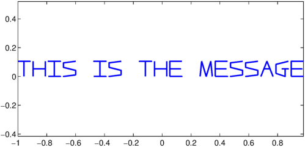
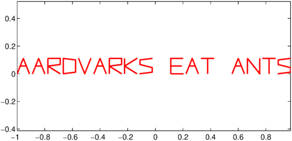
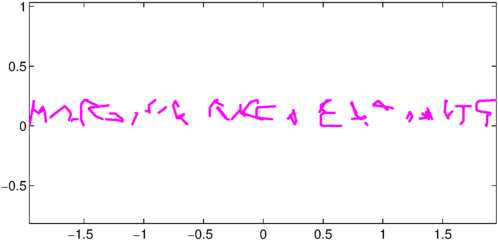
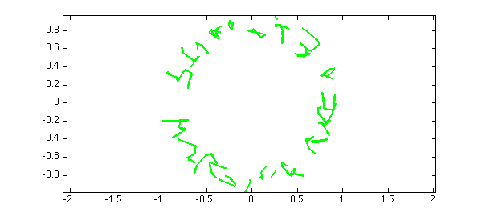
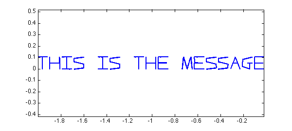

`scribble` produces piecewise linear complex chebfuns whose plots look like words, like this:

<pre class="mcode-input">message = scribble('This is the message');
LW = 'linewidth'; lw = 2;
plot(message, LW, lw), axis equal</pre>

Here's another string:

<pre class="mcode-input">key = scribble('Aardvarks eat ants');
plot(key, 'r', LW, lw), axis equal</pre>

Now if we plot the sum of the two, we get nonsense:

<pre class="mcode-input">encrypted = message + key;
plot(encrypted, 'm', LW, lw), axis equal</pre>

So we've invented a new encryption scheme!  For of course the original message can be recovered by subtracting off that key:

<pre class="mcode-input">message2 = encrypted - key;
plot(message2, LW, lw), axis equal</pre>

So long as we're investigating the world's most expensive and least secure method of encryption, we might as well tangle up the text in the complex plane a bit too.  I'll bet you can't read this:

<pre class="mcode-input">scrambled = exp(1.5i*(encrypted));
plot(scrambled, 'g', LW, lw), axis equal</pre>

But we can get the message back with a little unscramble:

<pre class="mcode-input">message3 = unwrap(log(scrambled))/1.5i - 1 - key;
plot(message3, LW, lw), axis equal</pre>

