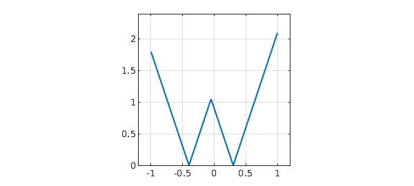
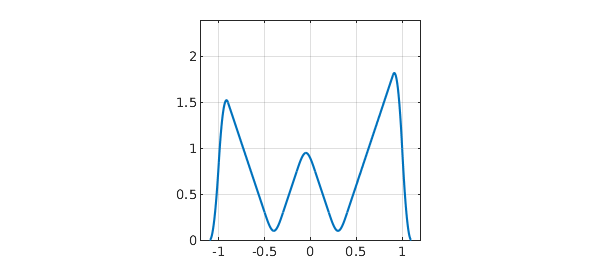
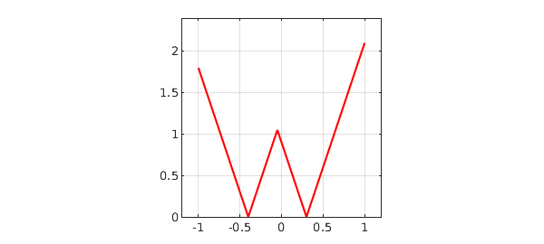
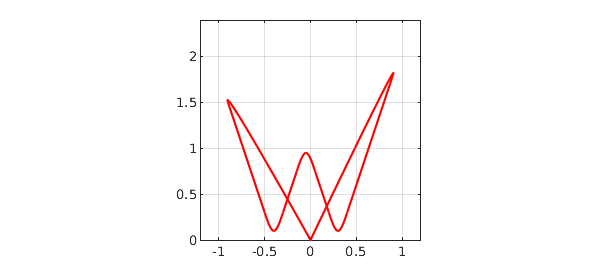

Here is a function with the shape of a W:

<pre class="mcode-input">t = chebfun(@(t) t);
f = 3*min(abs(t+.4),abs(t-.3));
LW = 'linewidth'; lw = 2;
ax = [-1.2 1.2 0 2.4];
plot(f,LW,lw), axis(ax), axis square, grid on</pre>

And here is a narrow function with integral equal to $1$:

<pre class="mcode-input">h = 0.1;
s = chebfun(@(s) s,[-h h]);
g = (h-abs(s))/h^2;
plot(g,'k',LW,lw), axis([-1 1 0 12]), grid on</pre>

If we convolve the two functions, we get a W with rounded corners. At the ends, the "rounding" has brought the values down to $0$:

<pre class="mcode-input">f2 = conv(f,g);
plot(f2,LW,lw), axis(ax), axis square, grid on</pre>

Let's try a similar but different computation in which the W is not a real function of a real variable, but a complex function of a real parameter.  Here is that complex function:

<pre class="mcode-input">W = t + 1i*f(t);
plot(W,'r',LW,lw), axis(ax), axis square, grid on</pre>

And here is its convolution with g:

<pre class="mcode-input">W2 = conv(W,g);
plot(W2,'r',LW,lw), axis(ax), axis square, grid on</pre>

Do you understand why thse picture looks different from the previous one?

